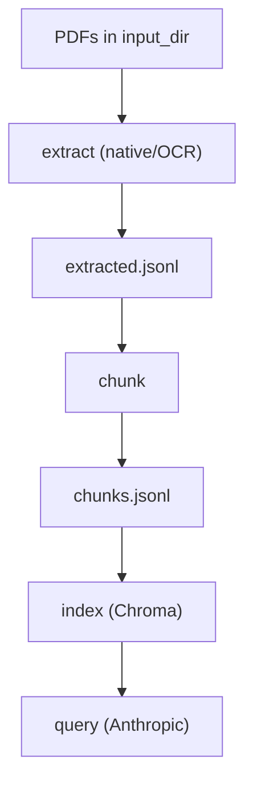

# PDF Preprocessing Pipeline

End-to-end pipeline to extract text from PDFs (native or scanned), chunk it, build a Chroma vectorstore, and query with Anthropic + LangChain.

## Features
- Multiple PDF extractors: `pypdf`, `pdfplumber`, `pymupdf`, `pdfminer`, `unstructured`
- OCR modes: `auto`, `tesseract`, `easyocr`, `llm`, `off`
- Chunkers: `recursive`, `character`, `token`, `nltk`, `spacy`, `markdown`, `html`, `latex`, `semantic`
- Chroma vectorstore with SentenceTransformers embeddings
- Anthropic query (Claude Haiku by default; configurable)

## Install
```bash
pip install -r requirements.txt
pip install -r requirements-extras.txt  # optional
```

### System dependencies
- **Tesseract OCR** (required for `tesseract` OCR)
- **Poppler** (required for `pdf2image` rendering)

## Quick Start
```bash
python3 -m preprocessing.cli list-options

# With default config.yml present:
python3 -m preprocessing.cli pipeline

# Or explicitly with flags:
python3 -m preprocessing.cli extract \
  --input-dir ./data/pdfs \
  --output ./data/out/extracted.jsonl \
  --extractor pypdf \
  --ocr auto

python3 -m preprocessing.cli chunk \
  --input ./data/out/extracted.jsonl \
  --output ./data/out/chunks.jsonl \
  --chunker recursive \
  --chunk-size 1000 \
  --chunk-overlap 150

python3 -m preprocessing.cli index \
  --input ./data/out/chunks.jsonl \
  --persist-dir ./data/chroma \
  --collection pdfs

python3 -m preprocessing.cli query \
  --persist-dir ./data/chroma \
  --collection pdfs \
  --question "¿De qué trata el documento?"
```

## One-shot pipeline
```bash
python3 -m preprocessing.cli pipeline

# Override defaults if needed:
python3 -m preprocessing.cli pipeline \
  --input-dir ./data/pdfs \
  --work-dir ./data/out \
  --extractor pypdf \
  --ocr auto \
  --chunker recursive \
  --chunk-size 1000 \
  --chunk-overlap 150 \
  --collection pdfs
```

## Smoke script
```bash
./scripts/smoke_pipeline.sh ./data/pdfs ./data/out
```

## Config file
If you don’t pass `--config`, the CLI auto-loads `config.yml` (preferred) or `config.yaml` from the current working directory.
Use `--config config.yml` explicitly if you want to point elsewhere. See `config.example.yml`.

### Full config reference (all options)
```yaml
# config.yml
input_dir: "./data/pdfs"
output_dir: "./data/out"
recursive: true

extraction:
  extractor: "pypdf"        # pypdf | pdfplumber | pymupdf | pdfminer | unstructured
  ocr: "auto"               # auto | tesseract | easyocr | llm | off
  force_ocr: false
  ocr_lang: "eng"           # Tesseract language code
  easyocr_langs: ["en"]     # EasyOCR language list
  min_text_per_page: 25
  ocr_llm_model: null       # e.g. "claude-3-5-sonnet-latest"
  ocr_llm_max_tokens: 1024

chunking:
  chunker: "recursive"      # recursive | character | token | nltk | spacy | markdown | html | latex | semantic
  chunk_size: 1000
  chunk_overlap: 150
  chunk_kwargs: {}          # optional extra args for splitter

indexing:
  persist_dir: "./data/chroma"
  collection: "pdfs"
  embedding_model: "sentence-transformers/all-MiniLM-L6-v2"

query:
  model: "claude-haiku-4-5"
  temperature: 0.2
  k: 5
  max_tokens: 1024
  show_sources: true
  relevance_threshold: null  # applies when score_metric=relevance
  distance_threshold: null   # applies when score_metric=distance
  score_metric: "auto"       # auto | relevance | distance
  rerank:
    enabled: false
    model: "cross-encoder/ms-marco-MiniLM-L-6-v2"
    top_n: 5
    threshold: 0.0
```

## API keys (.env)
The CLI will load environment variables from a `.env` file if present. You can also pass a specific file:
```bash
python3 -m preprocessing.cli --env-file .env
```
Copy `.env.example` to `.env` and set:
- `ANTHROPIC_API_KEY` (required for `query` and `llm` OCR)
- `HF_TOKEN` (optional, for faster model downloads)

## User Manual
This section is a practical guide for day-to-day usage.

### 1) Prerequisites
1. Python 3.10+
2. System tools:
   - `tesseract` (OCR)
   - `pdftoppm` (Poppler for PDF rendering)
3. Optional GPU/accelerators are not required.

### 2) Installation
```bash
pip install -r requirements.txt
pip install -r requirements-extras.txt  # optional
```

### 3) Configuration
The CLI auto-loads `config.yml` in the project root. Edit these defaults as needed:
1. `input_dir`: folder with PDFs
2. `output_dir`: where `extracted.jsonl` and `chunks.jsonl` will be written
3. `indexing.persist_dir`: Chroma storage
4. `extraction.ocr`: set to `auto` for mixed PDFs

### 4) Run the full pipeline
```bash
python3 -m preprocessing.cli pipeline
```
This will:
1. Extract text to `output_dir/extracted.jsonl`
2. Chunk to `output_dir/chunks.jsonl`
3. Build a Chroma index in `indexing.persist_dir`

### 5) Run step by step
```bash
python3 -m preprocessing.cli extract
python3 -m preprocessing.cli chunk
python3 -m preprocessing.cli index
python3 -m preprocessing.cli query --question "¿De qué trata el documento?"
```
Each command uses defaults from `config.yml` unless overridden by flags.
If you set `query.relevance_threshold`, it applies only when `score_metric=relevance`.
If you set `query.distance_threshold`, it applies only when `score_metric=distance`.

### 6) Choose extractor and OCR mode
Extractors (use `--extractor`):
- `pypdf`: fast and reliable for native PDFs
- `pdfplumber`: good for layout-heavy PDFs
- `pymupdf`: robust, often best for complex PDFs
- `pdfminer`: older but stable
- `unstructured`: powerful, requires extra deps

OCR modes (use `--ocr`):
- `auto`: use native extraction, OCR only when pages are sparse
- `tesseract`: traditional OCR
- `easyocr`: neural OCR (slower, often better on scans)
- `llm`: OCR via Anthropic (requires API key)
- `off`: native extraction only

### 7) Choose chunking method
Chunkers (use `--chunker`):
- `recursive`: best default
- `character`: strict character splits
- `token`: token-based splits
- `nltk`, `spacy`: sentence-aware (optional deps)
- `markdown`, `html`, `latex`: structure-aware (optional deps)
- `semantic`: embedding-aware (optional deps, slower)

### 8) API keys
Use `.env` for keys:
```
ANTHROPIC_API_KEY=...
HF_TOKEN=...
```
If you see an auth error, verify `ANTHROPIC_API_KEY` is set.

### 9) Listing available options
```bash
python3 -m preprocessing.cli list-options
```

### 10) Troubleshooting common errors
1. “Could not resolve authentication method”: set `ANTHROPIC_API_KEY` or use `--env-file`.
2. Hang with `mutex.cc`: use the troubleshooting steps below or a fresh venv.
3. Missing OCR tools: install Tesseract + Poppler.
4. No chunks returned: lower `query.relevance_threshold` or set it to `null`.

## Workflow Diagram


## Example Output
After running:
```bash
python3 -m preprocessing.cli pipeline
```

You should see:
```text
./data/out/extracted.jsonl
./data/out/chunks.jsonl
./data/chroma/
```

Sample `extracted.jsonl` line:
```json
{"text":"Example page text...","metadata":{"source":"./data/pdfs/sample.pdf","page":0,"page_count":1,"extractor":"pypdf","ocr_engine":null,"ocr_used":false}}
```

Sample `chunks.jsonl` line:
```json
{"text":"Example chunk text...","metadata":{"source":"./data/pdfs/sample.pdf","page":0,"page_count":1,"extractor":"pypdf","ocr_engine":null,"ocr_used":false}}
```

Sample query run:
```bash
python3 -m preprocessing.cli query --question "¿De qué trata el documento?"
```
To enforce a minimum relevance:
```bash
python3 -m preprocessing.cli query --question "¿De qué trata el documento?" --relevance-threshold 0.5
```
To enforce a maximum raw distance (requires score_metric=distance):
```bash
python3 -m preprocessing.cli query --question "¿De qué trata el documento?" --score-metric distance --distance-threshold 0.25
```
To enable reranking (optional):
```bash
python3 -m preprocessing.cli query --question "¿De qué trata el documento?" --rerank --rerank-top-n 5 --rerank-threshold 0.0
```
To control which score is used:
```bash
python3 -m preprocessing.cli query --question "¿De qué trata el documento?" --score-metric relevance
```

Example query output:
```text
Answer:
El documento describe los objetivos principales y el alcance del proyecto, con énfasis en el flujo de procesamiento y los resultados esperados.

Sources:
- ./data/pdfs/sample.pdf (page: 0) | relevance: 0.8921
```

## Notes
- For `semantic` chunking, install `langchain-experimental` and ensure the embedding model is available.
- For `unstructured` extraction, install `unstructured[pdf]`.
- Set `ANTHROPIC_API_KEY` in your environment before using `query` or `llm` OCR.
- The CLI disables Pydantic plugin auto-loading by default to avoid third-party plugin warnings. Unset `PYDANTIC_DISABLE_PLUGINS` if you need plugins.
- The CLI also sets safe environment defaults to reduce macOS hangs (e.g., transformers/tokenizers thread settings). Use `--no-safe-env` to opt out.
 - When running from the repo root, `sitecustomize.py` applies these defaults even earlier (before imports).

## Troubleshooting hangs
If the CLI hangs after a low-level warning (e.g., `mutex.cc`), try these steps:
1. Ensure TensorFlow is not being loaded by Transformers:
   - `export TRANSFORMERS_NO_TF=1`
2. Disable tokenizers parallelism and cap BLAS/OMP threads:
   - `export TOKENIZERS_PARALLELISM=false`
   - `export OMP_NUM_THREADS=1`
   - `export MKL_NUM_THREADS=1`
   - `export OPENBLAS_NUM_THREADS=1`
   - `export VECLIB_MAXIMUM_THREADS=1`
3. If the hang occurs when importing `torch` or `sentence-transformers`, create a clean virtualenv and install pinned requirements:
   - `python3 -m venv .venv`
   - `source .venv/bin/activate`
   - `pip install -r requirements.txt`
4. Re-run the CLI. If it works, you can leave the defaults enabled (the CLI sets these by default).

## Tests
Run core tests (base extractors + core chunkers):
```bash
PYTHONPATH=src python -m unittest discover -s tests -p "test_*.py"
```

Enable optional extractors/chunkers:
```bash
RUN_UNSTRUCTURED_TESTS=1 RUN_OPTIONAL_CHUNKERS=1 PYTHONPATH=src python -m unittest discover -s tests -p "test_*.py"
```

Enable OCR tests:
```bash
RUN_OCR_TESTS=1 PYTHONPATH=src python -m unittest discover -s tests -p "test_*.py"
```

Run everything in one command:
```bash
./scripts/run_all_tests.sh
```
The script validates system tools (`tesseract`, `pdftoppm`) and Python OCR deps before running.

## Comparison Report
Generate a comparative report across all extractors × chunkers:
```bash
python3 scripts/compare_techniques.py --question "¿De qué trata el documento?"
```

Optional flags:
- `--output ./reports/comparison.md`
- `--limit-pdfs 5`
- `--skip-existing/--no-skip-existing`
Missing extractor/chunker dependencies are skipped automatically and logged to the console.

You can also configure comparison defaults in `config.yml`:
```yaml
comparison:
  extractors: ["pypdf", "pdfplumber", "pymupdf", "pdfminer", "unstructured"]
  chunkers: ["recursive", "character", "token", "nltk", "spacy", "markdown", "html", "latex", "semantic"]
  limit_pdfs: null
  skip_existing: true
  output: "./reports/comparison.md"
```
